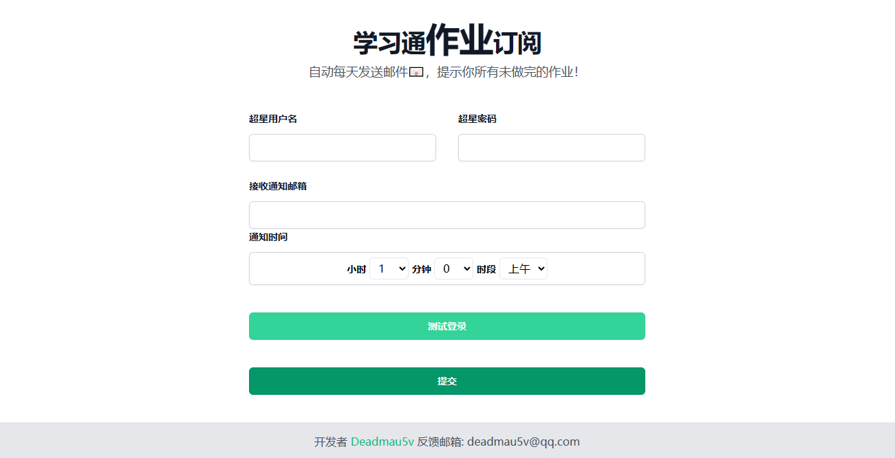
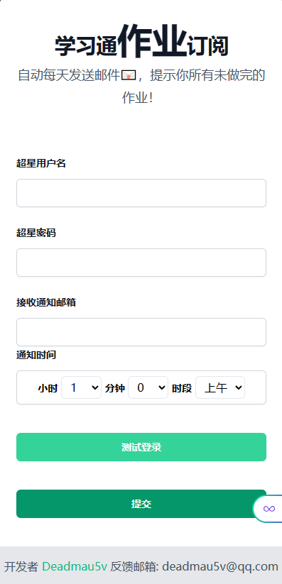

# 超星课程通知 项目

[]()

[English Docs(暂无)]() | [中文文档]()

## 用法

```shell
conda create -n chaoxing python=3.9
conda activate chaoxing
pip install -r requirements.txt
screen -R chaoxing  # 新建一个screen
python main.py  # 启动 WebUI
# 按下 Ctrl + A + D 后台运行 screen

screen -R chaoxing-producer  # 新建一个screen
python producer.py  # 启动生产者
# 按下 Ctrl + A + D 后台运行 screen

# 完成!
# 访问 http://localhost:5010 或者使用 Nginx 等负载均衡工具 反向代理
```

## 项目结构

```shell
Project
│  consumer.py  # 消费者 (用于发送邮件)
│  encod.py
│  img.png
│  img_1.png
│  log.txt
│  logo.png
│  main.py
│  private.pem
│  producer.py  # 生产者 (用于定时执行)
│  README.MD  
│  redis_db.py  # redis 模块一些方法的封装
│  requirements.txt  # 依赖
│
├─api  # chaoxing Api 实现
│  │  claases.py
│  │  configs.py
│  │  course.py
│  │  log.py
│  │  login.py
│  └─ __init__.py
│
├─data  # 用户登录Cookie缓存
│      users.json
│
└─templates   # jinja2 模板
       index.html
       mail.html
       remove_mail_success.html
       success.html
```

# 项目预览
## https://x.d5v.cc/
## PC

## Phone
